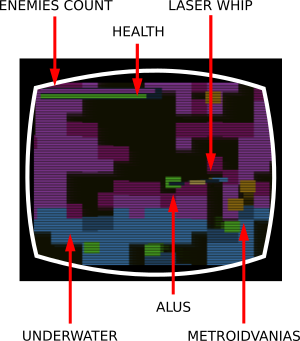
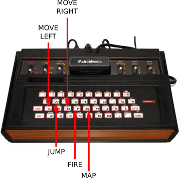

  
1KB PRINTABLE VIDEO GAME CARTRIGE

  

  
EXPLORE, FIGHT, IMPROVE, REPEAT!

  
<i>FOR OPENSOURCE JAVASCRIPT CONSOLE SYSTEM</i>

---

    <a href="https://www.kesiev.com/metroidvania/">Play the game</a> - <a href="sources/">About the printable project</a>

---

Instructions
---

The **Metroidvanias** invaded our planet and stolen all the powers to our only saviour **Alus**, the vampire space hunter.

    

You, as the mighty Alus, have to fight them all, take your special skills back and save the planet with the help of the **Long-Range Planet Map** (LRPM) and the incredible **laser whip**.

    

But it won't be an easy task: Metroidvanias are hidden on the top of the mountains and deep down underwater. Without your abilities you won't be able to reach them! Don't lose hope, Alus! The more of your powers you'll take back eliminating the Metroidvanias, the more you'll be able to explore.

So Alus, get ready to **explore, fight, improve and explore even more**!

Object
---

The object of the game is to destroy all of the Metroidvanias on the map before your health is fully depleted.

Setting the console controls
---

  - Go to the [game page](https://www.kesiev.com/metroidvania/) to play the game.

On the top left of the game screen you'll found two gauges: the purple one counts how many Metroidvanias are still alive and the green one the Alus health. If you get too near to Metroidvanias you'll lose some of your health and, if you lose all of it, it's game over!
Every time you lose a life a new map is generated, so you can play **unlimited game variations**!

The keyboard controls
---

Make sure you plug the computer keyboard firmly into the jacks at your video game system. If you're using a radio device, make sure that's paired correctly to your video game system.

    

Use A and D key to move Alus. Alus can move left and right and can jump with the W key. To fire with your laser whip hold down the F button and press the A or D button. With your whip can kill Metroidvanias and carve the cave rocks. To show the planet map hold down the G button.

---
_(C) Everybody Ltd. (EBY) 1982/Trademark owned by Nobody Ltd. (NBY) and originally developed by [KesieV](https://www.kesiev.com)_
