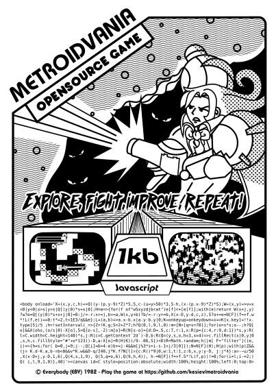

1KB PRINTABLE VIDEO GAME CARTRIGE

  

  
EXPLORE, FIGHT, IMPROVE, REPEAT!

  

---

    <a href="https://www.kesiev.com/metroidvania/">Play the game</a> - <a href="https://github.com/kesiev/metroidvania">Read the manual</a>

---

About the project
---
I was wondering how many nerdy things I love I could fit on a flyer without being too much crowded. These are my progresses so far:
  
  - **Videogames**: the flyer is meant to be an old-school videogame advertisement.
  - **Metroidvania**: the game title references to the [metroidvania](https://en.wikipedia.org/wiki/Metroidvania) genre, that's mostly abandoned by AAA developers and often related to indie developers.
  - **Drawing**: the upper half of the flyer displays a line art of our hero in action. The pose has been inspired by the [Super Metroid](https://en.wikipedia.org/wiki/Super_Metroid) cover.
  - **Male and female coding and gaming**: the flyer depicts Alus, the main character, that's a mix of the main characters of the games that defined the genre, the female [Samus Aran](https://en.wikipedia.org/wiki/Samus_Aran) from the [Metroid](https://en.wikipedia.org/wiki/Metroid) series and the male [Alucard](https://en.wikipedia.org/wiki/Alucard_(Castlevania)) from [Castlevania: Symphony of the Night](https://en.wikipedia.org/wiki/Castlevania:_Symphony_of_the_Night). The final design tries to keep the Alus genre not defined.
  - **Retrogaming**: it refers to the [retrogaming](https://en.wikipedia.org/wiki/Retrogaming) culture, taking inspiration from 90s advertising design of the [Atari 2600](https://en.wikipedia.org/wiki/Atari_2600) videogames.
  - **Pop culture**: The overall layout has been inspired by the [Star Wars: The Empire Strikes Back](https://www.pinterest.com/.pin/325314773053159384/?lp=true) advertising videogame flyer.
  - **Videogame philosophy**: it contains a citation that works both as game instruction and my own personal life advice: _Explore, fight, improve, repeat!_
  - **Low-budget projects**: it visually suggests old-school low budget and homebrew software development, showing hand-drawn screenshots of the game on cathode TV screens.
  - **Game cartridge**: a sketchy game cartrige is shown in the middle of the flyer.
  - **JavaScript**: it promotes one of the most easy and spread progamming language of the last years, [JavaScript](https://it.wikipedia.org/wiki/JavaScript).
  - **Esoteric progamming / Code golfing**: it suggests coding as self-challenge and expressive form, depicting the game source code uncompressed and code-golfed in 1kb of JavaScript, formatted as a rectangle.
  - **Code sharing**: the flyer suggest that the game has been developed by _Everybody_, a fictional company.
  - **Opensource**: the whole project is printed on a single flyer and links to an open code repository. (ATM this GitHub repository)
  - **CRT**: the game implements simple [cathode ray tube](https://en.wikipedia.org/wiki/Cathode_ray_tube) televisions effects like [scan lines](https://en.wikipedia.org/wiki/Scan_line) and [ghosting](https://en.wikipedia.org/wiki/Ghosting_(television)).
  - **Pixel art**: the game style mimicks the Atari age aesthetics, with squared elements and flashing lights, like 80s hit [Adventure](https://en.wikipedia.org/wiki/Adventure_(Atari_2600)).
  - **Roguelike**: every stage of the game is [procedurally generated](https://en.wikipedia.org/wiki/Procedural_generation) via [cellular automata](http://www.roguebasin.com/index.php?title=Cellular_Automata_Method_for_Generating_Random_Cave-Like_Levels).
  - **Multidirectional scrolling Run and Gun**: the game is a tiny open-world shooting/platformer with destructable environment.
  - **Improve and explore**: the game is a demake of the Metroidvania concept. Every time the main charater kills an enemy his/her jump and weapon improves, allowing further explorations. The main concept and storyline has been inspired by [Metroid II: Return of Samus](https://en.wikipedia.org/wiki/Metroid_II:_Return_of_Samus).
  - **World map**: the game features a world map, that helps on planning how to explore the cave.
  - **WASD layout**: the game is played using [WASD keys](https://en.wikipedia.org/wiki/Arrow_keys#WASD_keys), one of the most used layouts in computer gaming.

If you like it, you can print it and stick wherever you like. I'm going to print it on a T-shirt.

- [ ] Print on T-shirt and share a photo.

You can find me on [Twitter](https://twitter.com/kesiev). Feel free to share your impressions and thoughts!

Project sources
---

The project includes:

  - **game/**: The game source codes.
    - **metroidvania.html**: The _development version_ of the game. It's still not very documented but I'm used to [in-depth](https://github.com/kesiev/TinyHAL/blob/master/tinyhal.js) [descriptions](https://github.com/kesiev/mmry/blob/master/mmry.js) of golfed code, so I'll do the same to Metroidvania on demand.
    - **metroidvania.min.js**: The packed version. I've used [Packer](http://dean.edwards.name/packer/) since it nicely clean up the code without adding any compression, making it still printable. As a project guideline, it should be 1kb or less.
  - **manual/**: The assets I've used for making the manual. I've used [Inkscape](https://inkscape.org/en/) and [GIMP](https://www.gimp.org/).
  - **printables/**: Stuff about this project that you can print. There is the final flyer SVG and the runnable code of the game, formatted as a rectangle.
